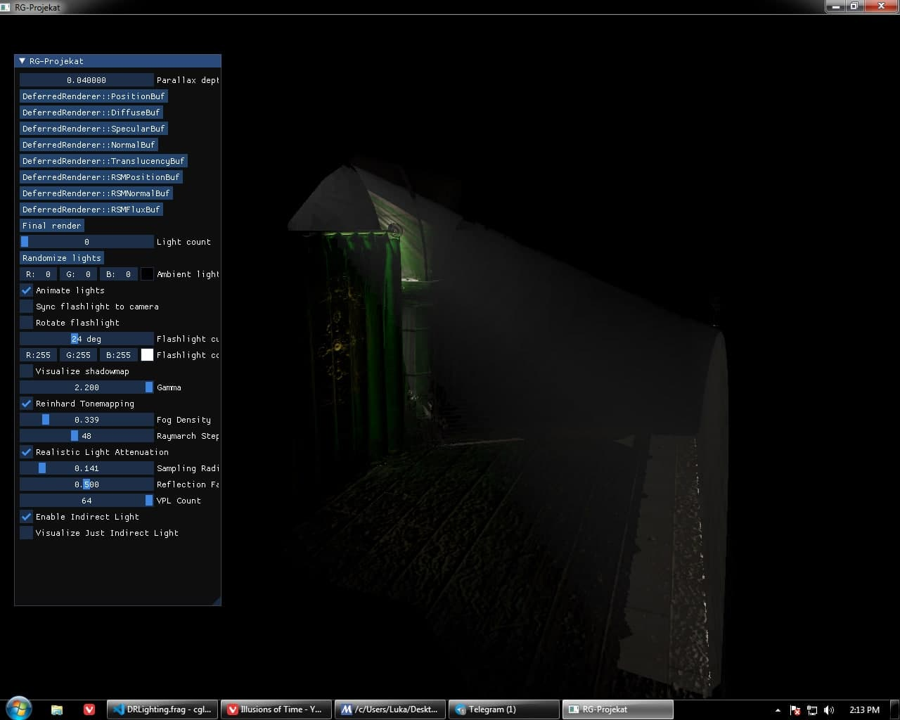
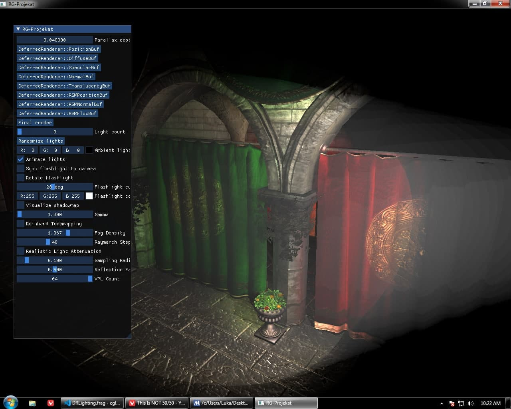
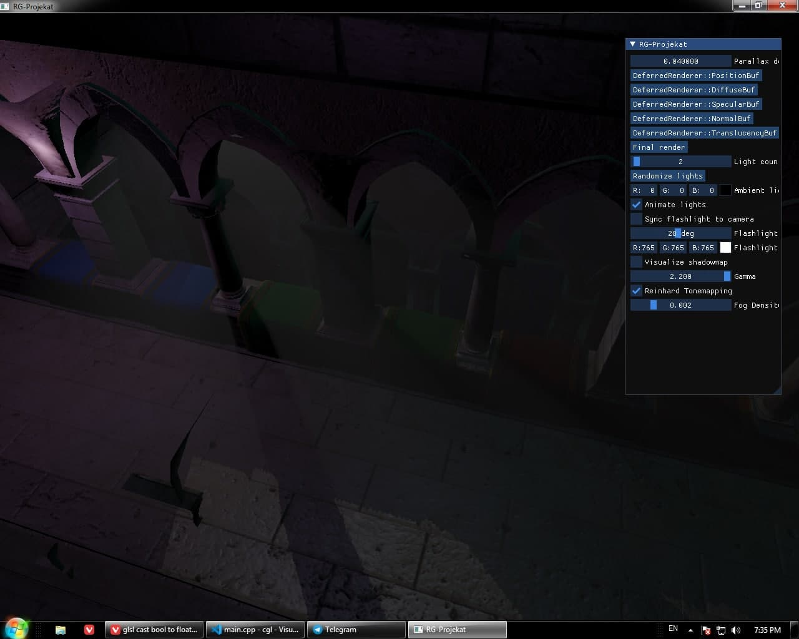
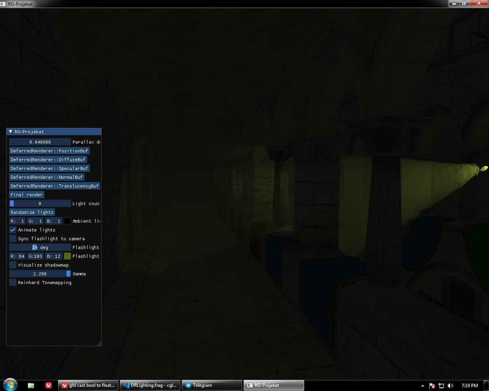
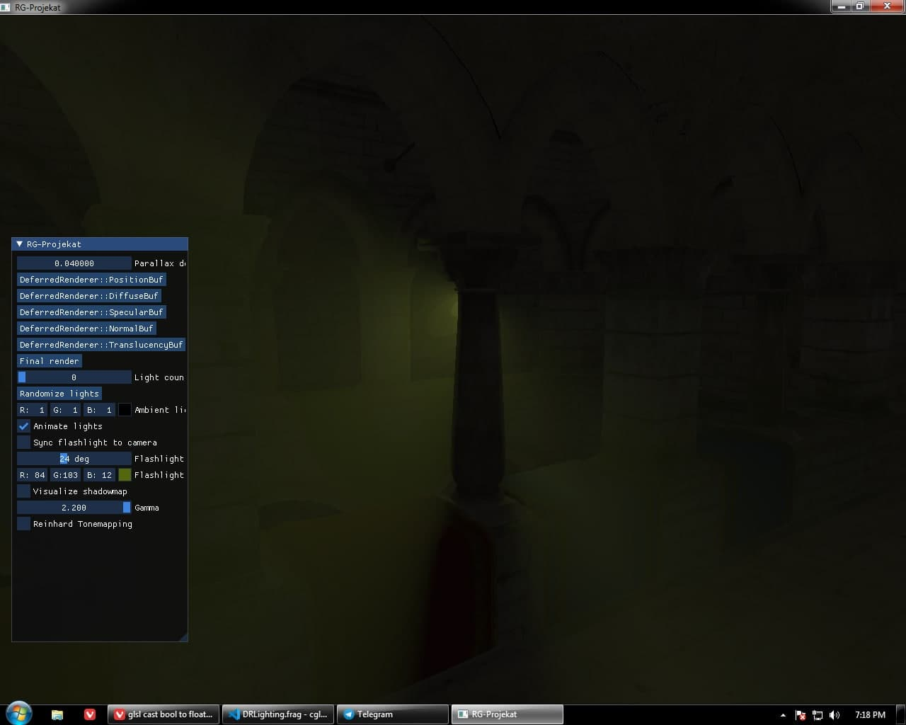

# Projekat iz Računarske grafike 2021. / Computer Graphics University Project 2021.

## Uputstvo / Instructions

Kompilacija standardnom procedurom:

Compiling is done with the standard procedure:

```
mkdir build
cd build
cmake ..
make
```

Kompilacija je testirana na operativnim sistemima Windows 7 (samo sa MSYS2!) i Manjaro Linux. 
Biblioteke glfw, assimp i glm moraju biti instalirane gde CMake može da ih nadje. 
Biblioteke imgui i glad su uključene u ovaj git repository.

Compilation is tested on the operating systems Windows 7 (with MSYS2 only!) and Manjaro Linux. The libraries glfw, assimp and glm must be installed where CMake can find them. The libraries imgui and glad are bundled in this git repository.

Startuje se iz sa:

Start the program with:

```
./RG-Projekat
```

Radni folder (current working directory) mora biti `build` folder, da bi program mogao da nadje
neophodne fajlove.

The current working directory must be the `build` folder, so the program can find the necessary data files.

## Implementirane tehnike / Implemented techniques

* Učitavanje (putem biblioteke assimp) i prikazivanje poznatog test modela palate Sponza / Loading (via assimp) and displaying of the famous test model of Sponza palace
* Kamera sa standardnim WASD kontrolama / A standard FPS-style camera
* Kompletan Blin-Fong model osvetljenja / The complete Blinn-Phong lighting model
* Deferred Rendering
* Do 100 animiranih tačkastih svetala (point lights) bez senki / Up to 100 animated point lights without shadowmapping
* Jedan animiran reflektor (spot light) sa senkama / One animated spotlight with shadowmapping
* HDR/Gamma correction/Reinhard tone mapping
* Normal mape, spekular mape / Normal maps, specular maps
* [Relief Parallax Mapping](https://web.archive.org/web/20190131000650/https://www.sunandblackcat.com/tipFullView.php?topicid=28)
* [Reflective Shadow mapping](https://ericpolman.com/2016/03/17/reflective-shadow-maps/)
* [Raymarched volumetric light](http://www.alexandre-pestana.com/volumetric-lights/)

## Slike / Screenshots






